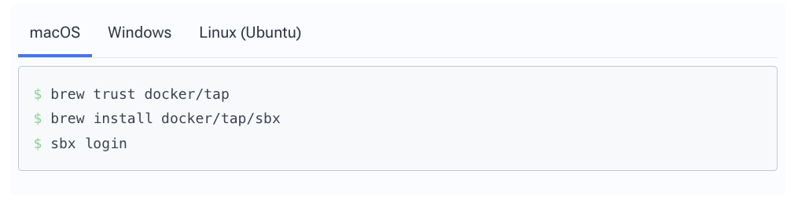

# Docker Sandbox demo

## Slides - background context, rationale, features
[Slides](presentation/SBX-demo.pptx)

## Setup

https://docs.docker.com/ai/sandboxes/get-started/



_Optional (allow the agent to create PRs) - Storing Github access token in credential manager (replace with your token env variable):_

`sbx secret set -g github -t "$GITHUB_AGENT_SANDBOX_TOKEN"`


Optional (allow Jev usage) - Store Jev API key in credential manager (replace with your token env variable):

```
sbx secret set-custom \
--host api.typesafe.ai \
--env TYPESAFE_API_KEY \
--value <your-typesafe-api-secret>
```


## Basic commands


The most basic command - Spawn a new Codex sandbox from a template, mounted in this workspace: _(You can replace with 'claude' or others)_

`sbx run codex`

**Let's do this instead:**
Create a named Codex sandbox with ports 3000 and 3001 exposed to the host, then start Bash inside it to update Codex to latest version and launch it:

`sbx create --name my-codex --publish 3000:3000 --publish 3001:3001 codex . && sbx exec -it my-codex bash -lc 'codex update && exec codex'`


_(First creation of a Codex sandbox will download image and prompt for Codex login)_


SBX interactive control plane:

`sbx`

List all sandboxes:

`sbx ls`

Execute a command in a running sandbox - in this example running interactive bash:

`sbx exec -it my-codex bash`

To connect to a sandbox from Codex or Claude Code desktop, via SSH, use this URL:

`ssh://agent@my-codex.sbx`

### Example fully autonomous tasks to try (will touch system files, install tools and run Docker with no restrictions):

```
Create a process environment secret checker that runs and prints output whenever any user
starts a new interactive bash shell on the machine, including login shells and nested bash sessions.

The secret checking must use TypeSafe's API on each environment variable separately (key + value),
and classify each as real_secret, dummy_test, or not_secret. Run the classification in parallel for all environment variables, with unlimited concurrency.
Always show a table with the environment variable name, truncated value, classification, and confidence result.
Include all real_secret and dummy_test classifications, and include not_secret only when its confidence score is below 50%.
Ensure it does not run for noninteractive scripts and does not print twice for a single shell startup.

The source code should be located in this repo under src/jev-env/, but symlinked from the appropriate global folder in user home. 

TypeSafe API key is available as TYPESAFE_API_KEY on this machine.
The documentation for TypeSafe API is available at https://github.com/typesafe-ai/skills/blob/main/skills/typesafe-ai/SKILL.md.
```

--------

```
Work only under src/control-plane. Work in a separate worktree.

Create a web-based file browser, docker browser, and Codex task dispatcher.
The backend is in Node.js and Express, and the frontend is in React.

The app has a sidebar with three sections: File Browser, Docker Browser, and Codex Task Dispatcher:
- allow users to browse the file heirarchy in this machine (read-only, no file display)
- allow viewing Docker containers and their logs. When viewing a container, poll logs every second.
- allow dispatching single-prompt tasks to Codex on this machine - show the task status and textual output in real-time in a scrollable area.
Task dispatching should support picking a working dir for codex.

The app backend and frontend should be served on port 3000, and kept open when this task is done.

Install Playwright CLI globally on this machine, and use it for screenshot verification of the app's UI.
Create a deterministic frontend E2E test with mock data for the three sections, with git-versioned screenshot snapshots of each section's UI for validation.

Create a new GitHub PR with only your changes - the implementation and the E2E test including the versioned screenshot snapshot. Do not examine or reuse older PRs.
```


--------

```
Work only under src/agentic-engineering. Work in a separate worktree.

Create a tiny backend + colorful one-page react app, both served from inside a docker.
The theme of the app is "Agentic Engineering: stop with the slop".
Only show this as a visually appealing page, with only one textbox and button that says "Send to Docker log".
The button sends the input text to backend, which writes it to its console log.

For validation, you must install Playwright CLI globally on this machine (if not installed already), create a deterministic E2E test that creates a git-versioned screenshot snapshot, 
and verify that the snapshot is created and matches the expected frontend page layout. 
The app backend+frontend should be fully functional and accessible on a docker on port 3001 on task completion. 

Create a new PR on GitHub with only your changes - the implementation and the E2E test including the versioned screenshot snapshot. Do not examine or reuse older PRs.
```


## Snapshots

Save an ad-hoc template (snapshot):

`sbx template save my-codex my-codex:v1`

List templates:

`sbx template ls`

Stop and remove an unneeded sandbox:

`sbx stop my-codex`

`sbx rm my-codex`


Create a new sandbox from a saved template:

`sbx run -t my-codex:v1 --name my-codex codex`

_Optional - export and import_

`sbx template save my-codex my-codex:v1 --output my-codex.tar
`
`sbx template load my-codex.tar`

### Let's pretend for a moment that Codex got prompt-injected, or in a revengeful mood:

<span style="background-color: red; color: white;">🚨🚨🚨  ONLY RUN THIS INSIDE THE SANDBOX  🚨🚨🚨</span>

`! sudo rm -rf --no-preserve-root /`

<span style="background-color: red; color: white;">🚨🚨🚨  ONLY RUN THIS INSIDE THE SANDBOX  🚨🚨🚨</span>

After your sandbox got obliterated, please load the latest snapshot and move on with your day like nothing happened.


## Advanced developer environment

The [dotfiles subproject](dotfiles/README.md) shows a more advanced setup for a portable, secure, and reproducible developer environment. 
Its guide covers the sandbox setup and how to use it.


### Read about all the available features at https://docs.docker.com/ai/sandboxes/

- Dockerfile templates
- Multiple workspaces
- Network policies
- Kits
- Git isolation modes
- Exposing ports and services
- SSH access for desktop apps
- Credential injection
- Cloud sandboxes
