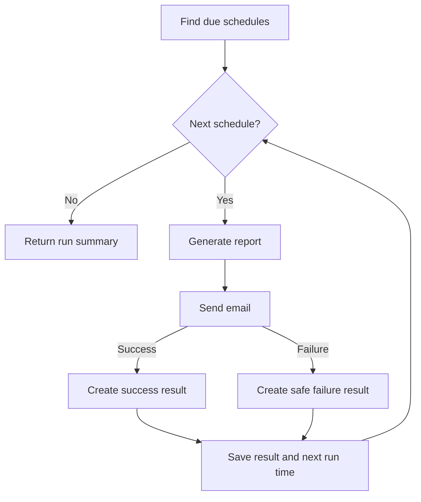

# Deep plan format

Use this format for Mode C. Apply the shared planning rules before writing the file. The template
and examples show the required sections and level of detail, not an architecture to copy.

Save the plan under `<project-root>/docs/plans/` with a lowercase kebab-case filename derived from
the task. If no project root is available, ask where the plan should be saved rather than inventing
a project.

<spec-template>

## Problem Statement or User need

The problem that the user is facing, or the user's need - from the user's perspective. Do not invent
or make up a problem if there is none. Do not add here unnecessary technical details - this is an
overview section.

<problem-statement-example>
Report owners send the same report each week. They must repeat this work each time. A report can be late, and owners cannot see its delivery status.
</problem-statement-example>

<user-need-example>
Report owners need a reliable way to send reports on a recurring schedule and see whether each delivery succeeds.
</user-need-example>

## Solution

The solution to the problem, from the user's perspective. Do not add here unnecessary technical
details - this is an overview section. Focus on what's really important.

<solution-example>
Report owners can create recurring delivery schedules.
At each scheduled time, the system creates the report, sends it to the selected recipients, and shows the delivery status.
</solution-example>

## User Stories

A numbered list of user stories. Each user story should be in the format of:

1. As an <actor>, I want a <feature>, so that <benefit>

<user-story-example>
1. As a report owner, I want to schedule recurring report delivery, so that I do not have to send each report myself.

2. As a recipient, I want to receive each report when it is due, so that I have current information.

3. As a report owner, I want to see the latest delivery status, so that I can identify failed
   deliveries. </user-story-example>

This list of user stories should cover all required aspects of the feature.

If the feature is an infrastructure, a library, a util or a developer tool - then the user is a
developer or a coder using it.

## Acceptance Criteria

A numbered list of observable, testable conditions that define completion. Cover required success,
failure, state-change, and boundary behavior without describing implementation details.

<acceptance-criteria-example>
1. When a user submits a valid recurrence, recipient list, and time zone, the API returns `201` and saves the schedule.

2. When the recurrence, recipients, or time zone is invalid, the API returns `400` and does not save
   a schedule.

3. Reading an existing schedule returns `200`. Reading an unknown schedule returns `404`.

4. Before `nextRunAt`, a scheduler run does not create or send a report.

5. At `nextRunAt`, a scheduler run creates and sends one report. It saves a success status and
   advances `nextRunAt`.

6. If delivery fails, the system saves the error, advances `nextRunAt`, and does not retry the
   failed run.

7. After a daylight-saving time change, the next run keeps the configured local time.
   </acceptance-criteria-example>

## Implementation Decisions

A list of implementation decisions that were made. This can include:

- The modules that will be built/modified
- The interfaces of those modules that will be modified
- Technical clarifications from the developer
- Architectural decisions
- Schema changes
- API contracts
- Specific interactions

This is not the place for a complete technical spec, or tiny implementation details. The sections
should contain a readable summary of the important high-level implementation decisions and direction
taken.

The example shows the required level of detail and approximate length and amount of information, not
the required architecture. Follow existing patterns and add the fewest files and layers.

<implementation-decisions-example>
- Modules:
  - Add the schedule model, repository, service, and due-report runner.
  - Change the report routes and the existing scheduler.

- Interfaces:
  - Add `create(input): Promise<ReportSchedule>`.
  - Add `findDue(now): Promise<ReportSchedule[]>`.
  - Add `runDueReports(now): Promise<RunSummary>`.

- Technical clarification:
  - Store `nextRunAt` in UTC.
  - Calculate each next run from the saved time zone so that the local time stays the same after
    daylight-saving time changes.

- Architecture:
  - Reuse the existing scheduler, report generator, and email module.
  - Do not add another job system.

- Schema:
  - Add a `report_schedules` table.
  - Store the report, recurrence, recipients, time zone, next run time, latest run time, latest
    status, and latest error.

- API:
  - `POST /report-schedules` validates the request and returns `201 ReportSchedule`.
  - `GET /report-schedules/:id` returns `200 ReportSchedule` or `404`.

- Interactions:
  - For each due schedule, create the report and try to send it.
  - Save the result and calculate the next run.
  - Do not retry a failed run. </implementation-decisions-example>

## Mechanisms that can be reused

List the existing parts that can be used as they are or adapted. Follow the reuse order in the
shared planning rules.

<mechanisms-that-can-be-reused-example>
- Reuse the existing report generator and email module. Do not create a second delivery path.

- Change the existing scheduler in `src/scheduler.ts`. Do not add another job system.

- Reuse the existing route validation and report API test setup.
  </mechanisms-that-can-be-reused-example>

## Verification Decisions

A list of verification decisions that were made, and a full list of the required verification
scenarios. Include:

- A description of what makes a good test for testing external behavior
- Which modules will be verified and how
- Prior art for verification in the codebase, and how it can be reused to avoid duplication

<verification-decisions-example>
- Verify external behavior through API responses, sent email messages, and saved schedule status.

- Reuse the existing report API test setup for the report routes and due-report runner. Replace only
  the external email service during tests.
- Control the clock so that tests can make schedules due without waiting.

- Add end-to-end tests for these scenarios:
  1. Create a schedule with a valid recurrence, recipient list, and time zone. Expect `201` and the
     saved schedule in the response.

  2. Test an invalid recurrence, an empty recipient list, and an unknown time zone. For each
     request, expect `400` and no saved schedule.

  3. Read an existing schedule. Expect `200` with its next run time and latest status.

  4. Read an unknown schedule ID. Expect `404`.

  5. Run the scheduler before `nextRunAt`. Expect no report, no email, and no status change.

  6. Run the scheduler at `nextRunAt`. Expect one report, one email to the saved recipients, a
     success status, and the next run time.

  7. Cause email delivery to fail. Expect a failure status, the error summary, the next run time,
     and no retry for the failed run.

  8. Run a schedule across a daylight-saving time change. Expect the next run to keep the configured
     local time. </verification-decisions-example>

## What's in scope for the technical implementation

List only the work needed to meet the request, including requirements established by evidence from
the codebase or external constraints.

<in-scope-example>
- Create and read report schedules through the API.

- Validate the recurrence, recipients, and time zone with the existing validation tools.

- Save schedules and find schedules that are due.

- Create and email each due report.

- Save the latest success or failure status.

- Add end-to-end tests for schedule storage, API behavior, and execution. </in-scope-example>

## Out of Scope

A description of the things that are out of scope for this spec. List only plausible adjacent work
that a developer or reviewer could assume is included.

<out-of-scope-example>
- Editing, pausing, or deleting schedules.

- Delivery channels other than email.

- Automatic retries or delivery of missed reports.

- A new job queue or scheduler.

- New report formats or report-builder changes.

- A user interface for schedule management. </out-of-scope-example>

## Technical implementation summary

Use exactly these two subsections:

### 1. Public shape specification

List the exact files and all public symbols or schemas to add, change, or remove.

- Label each item as added, changed, or removed.
- Use fenced code blocks for public types, interfaces, function signatures, methods, classes,
  structs, enums, exceptions, and API contracts.
- Include declarations only. Do not include implementation bodies or pseudocode.
- Specify data schemas precisely enough to show fields, types, nullability, and constraints.
- Use blank lines and normal code formatting so each contract is easy to scan.
- Do not use vague statements such as "add a type for status updates." Specify the public type.
- If the implementation does not change a public symbol or schema, write `None`.

### 2. Implementation detail

For each new or changed implementation, prefix a short, simple, and readable summary with the exact
file name.

- Explain what the implementation does or what will change.
- Name the exact symbols that the implementation reuses.
- Do not repeat declarations from the public shape specification.
- Do not restate acceptance criteria as implementation detail.
- Keep ordinary implementation summaries brief.

Give each high-impact implementation detail its own clearly named section. A detail is high-impact
only when it has a meaningful effect on performance, scope, security, maintainability, or possible
side effects. Each high-impact section must name the affected files, explain the impact, and
describe the relevant flow. Use a visualization or table instead of prose when it makes the flow or
trade-off easier to understand. Do not create a high-impact section for routine implementation.

The following example shows the required format and level of detail. It is not a reference
architecture for the current task. Follow existing project patterns and add the fewest files and
layers.

<technical-summary-example>
### 1. Public shape specification

- Add the `report_schedules` schema in `db/migrations/20260101_create_report_schedules.sql`:

  | Column          | Type                    | Null | Constraint              |
  | --------------- | ----------------------- | ---: | ----------------------- |
  | `id`            | Existing report ID type |   No | Primary key             |
  | `report_id`     | Existing report ID type |   No | References `reports.id` |
  | `recurrence`    | Text                    |   No |                         |
  | `recipients`    | JSON list of strings    |   No | At least one recipient  |
  | `time_zone`     | Text                    |   No |                         |
  | `next_run_at`   | Existing timestamp type |   No | Indexed                 |
  | `latest_run_at` | Existing timestamp type |  Yes |                         |
  | `latest_status` | Text                    |  Yes | `success` or `failure`  |
  | `latest_error`  | Text                    |  Yes |                         |

- Add these public types in `src/reports/report-schedule.ts`:

  ```typescript
  export interface CreateReportScheduleInput {
    reportId: string;
    recurrence: string;
    recipients: string[];
    timeZone: string;
  }

  export type RunStatus = "success" | "failure";

  export interface ReportSchedule extends CreateReportScheduleInput {
    id: string;
    nextRunAt: Date;
    latestRunAt: Date | null;
    latestStatus: RunStatus | null;
    latestError: string | null;
  }

  export interface RunCompletion {
    runAt: Date;
    status: RunStatus;
    error: string | null;
    nextRunAt: Date;
  }

  export interface RunSummary {
    due: number;
    succeeded: number;
    failed: number;
  }
  ```

- Add these public functions in `src/reports/report-schedule-repository.ts`:

  ```typescript
  export declare function create(
    input: CreateReportScheduleInput,
    nextRunAt: Date,
  ): Promise<ReportSchedule>;

  export declare function findById(id: string): Promise<ReportSchedule | null>;

  export declare function findDue(now: Date): Promise<ReportSchedule[]>;

  export declare function markRunComplete(
    id: string,
    update: RunCompletion,
  ): Promise<ReportSchedule>;
  ```

- Add this public exception and these public functions in `src/reports/report-schedule-service.ts`:

  ```typescript
  export type InvalidReportScheduleField = "recurrence" | "recipients" | "timeZone";

  export declare class InvalidReportScheduleError extends Error {
    constructor(field: InvalidReportScheduleField, message: string);

    readonly field: InvalidReportScheduleField;
  }

  export declare function create(input: CreateReportScheduleInput): Promise<ReportSchedule>;

  export declare function findById(id: string): Promise<ReportSchedule | null>;
  ```

- Add these public HTTP operations in `src/reports/routes.ts`:

  ```text
  POST /report-schedules
    Request:  CreateReportScheduleInput
    Success:  201 ReportSchedule
    Error:    400 { code: "INVALID_REPORT_SCHEDULE", field, message }

  GET /report-schedules/:id
    Success:  200 ReportSchedule
    Error:    404 { code: "REPORT_SCHEDULE_NOT_FOUND", message }
  ```

- Add this public function in `src/reports/run-due-reports.ts`:

  ```typescript
  export declare function runDueReports(now: Date): Promise<RunSummary>;
  ```

### 2. Implementation detail

- `db/migrations/20260101_create_report_schedules.sql`: Create the schedule table and its
  `next_run_at` index. Reuse the ID and timestamp types from
  `db/migrations/20251201_create_reports.sql`.

- `src/reports/report-schedule.ts`: Define the shared schedule contracts used by the repository,
  service, routes, and runner.

- `src/reports/report-schedule-repository.ts`: Store schedules, read schedules by ID, find due
  schedules, and save run results.

- `src/reports/report-schedule-service.ts`: Validate creation input and calculate the first run.
  Reuse `parseRecurrence` and `nextOccurrence` from `src/scheduler/recurrence.ts`, `isEmail` from
  `src/validation/email.ts`, `isValidTimeZone` from `src/time/time-zone.ts`, and `clock.now` from
  `src/time/clock.ts`.

- `src/reports/routes.ts`: Add create and read handlers. Reuse `validateBody` from
  `src/http/validate-body.ts` and `writeHttpError` from `src/http/write-http-error.ts`.

- `src/reports/run-due-reports.ts`: Execute due schedules and return aggregate counts. Reuse
  `generateReport` from `src/reports/report-generator.ts`, `sendEmail` from
  `src/email/send-email.ts`, and `nextOccurrence` from `src/scheduler/recurrence.ts`.

- `src/scheduler.ts`: Change `runSchedulerCycle` to call `runDueReports` once with the cycle time.

- `test/report-schedule-repository.integration.ts`: Verify schedule persistence and due-schedule
  selection.

- `test/report-schedule-api.e2e.ts`: Verify schedule creation, validation, and reads through the
  API.

- `test/run-due-reports.e2e.ts`: Verify execution timing, delivery results, failure isolation, and
  daylight-saving behavior.

#### High-impact: Due-report side effects and failure isolation

Affected file: `src/reports/run-due-reports.ts`

Impact: Each run generates reports, sends email, and changes schedule state. A failed delivery must
not stop later due schedules or retry the failed occurrence.



#### High-impact: Recurrence across daylight-saving changes

Affected files: `src/reports/report-schedule-service.ts`, `src/reports/run-due-reports.ts`

Impact: Calculating from UTC alone can move the user's local delivery time after a daylight-saving
change.

| Step      | Rule                                                                                          |
| --------- | --------------------------------------------------------------------------------------------- |
| Read      | Use the saved recurrence and time zone.                                                       |
| Calculate | Reuse `nextOccurrence` from `src/scheduler/recurrence.ts`.                                    |
| Store     | Save the resulting instant in UTC as `nextRunAt`.                                             |
| Repeat    | Calculate each later occurrence from the saved time zone, not by adding a fixed UTC duration. |

</technical-summary-example>

## Task Breakdown

Split the implementation into isolated tasks that can be delegated and verified independently. State
dependencies, required order, and which tasks can run in parallel. Do not split unnecessarily, or if
the plan is small enough to be considered a single task.

For each task include:

- Scope: exact files and symbols
- Order: dependencies and parallelization
- Definition of done
- Verification: exact command or test scenario and expected result

Example for shape and format of task breakdown:

<task-breakdown-example>
1. Persistence
   - Scope:
     - Add `db/migrations/20260101_create_report_schedules.sql`.
     - Add `ReportSchedule` and `CreateReportScheduleInput` in `src/reports/report-schedule.ts`.
     - Add `create`, `findById`, `findDue`, and `markRunComplete` in `src/reports/report-schedule-repository.ts`.
     - Add `test/report-schedule-repository.integration.ts`.

- Order: Do this first. Tasks 2 and 3 depend on it.

- Definition of done: The migration runs successfully. The repository can create, read, find due,
  and update run status.

- Verification: Run `pnpm test -- test/report-schedule-repository.integration.ts`. Expect all
  repository scenarios to pass.

2. Schedule API
   - Scope:
     - Add `src/reports/report-schedule-service.ts`.
     - Change the report schedule routes in `src/reports/routes.ts`.
     - Add `test/report-schedule-api.e2e.ts`.

   - Order: Do this after task 1. It can run in parallel with task 3.

   - Definition of done: Acceptance criteria 1-3 pass.

   - Verification: Run `pnpm test -- test/report-schedule-api.e2e.ts`. Expect all API scenarios to
     pass.

3. Due report execution
   - Scope:
     - Add `runDueReports` in `src/reports/run-due-reports.ts`.
     - Change the scheduler cycle in `src/scheduler.ts`.
     - Add `test/run-due-reports.e2e.ts`.

   - Order: Do this after task 1. It can run in parallel with task 2.

   - Definition of done: Acceptance criteria 4-7 pass.

   - Verification: Run `pnpm test -- test/run-due-reports.e2e.ts`. Expect all execution scenarios to
     pass. </task-breakdown-example>

</spec-template>
